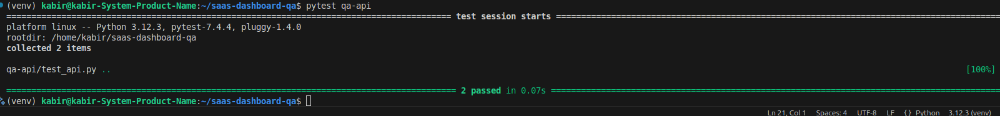
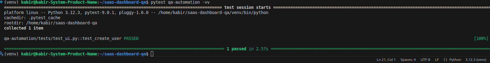
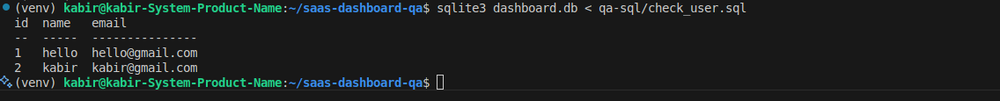
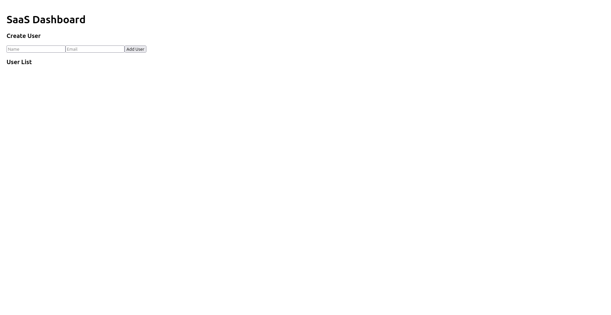
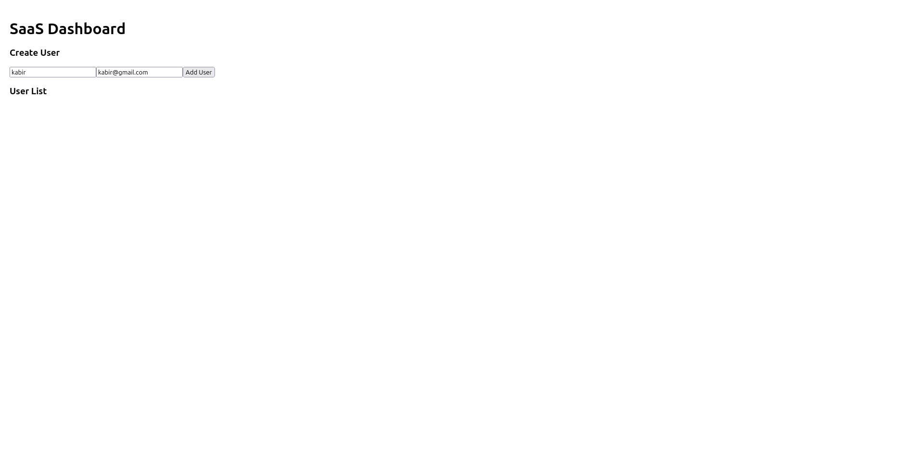
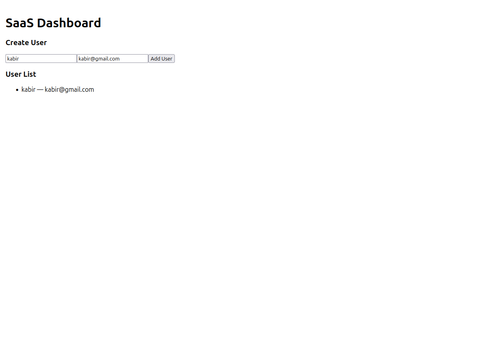

# 📌 **SaaS Dashboard QA Project**

A complete QA Engineering project demonstrating **manual testing**, **API testing**, **UI automation**, **database validation**, and **CI/CD** using **FastAPI + React + Playwright + pytest + SQLite**.

---

# 🚀 **Overview**

This project simulates a small **SaaS Dashboard** where users can be created and listed.
The purpose is to showcase real-world **QA engineering skills** used in SaaS companies.

**Includes:**

* ✔ Backend API (FastAPI + SQLite)
* ✔ Frontend UI (React)
* ✔ Manual Test Cases
* ✔ API Automation (pytest + requests)
* ✔ UI Automation (Playwright)
* ✔ SQL Database Validation
* ✔ GitHub Actions CI Pipeline
* ✔ QA Documentation (Excel)

---

# 🧱 **Tech Stack**

| Layer         | Tools                    |
| ------------- | ------------------------ |
| Backend       | FastAPI, Uvicorn, SQLite |
| Frontend      | React                    |
| API Testing   | pytest, requests         |
| UI Automation | Playwright               |
| DB Validation | sqlite3                  |
| CI/CD         | GitHub Actions           |
| Documentation | Excel, Markdown          |

---

# 📂 **Project Structure**

```
saas-dashboard-qa/
│── backend/
│     └── main.py
│
│── frontend/
│     └── dashboard-ui/
│
│── qa-api/
│     └── test_api.py
│
│── qa-automation/
│     └── tests/
│          └── test_ui.py
│
│── qa-sql/
│     └── check_user.sql
│
│── qa-manual/
│     ├── test-cases.xlsx
│     └── bug-reports.xlsx
│
│── screenshots/
│     ├── dashboard_home.png
│     ├── add_user.png
│     ├── user_list.png
│     ├── api_tests_passed.png
│     ├── ui_tests_passed.png
│     └── sql_output.png
│
│── .github/workflows/
│     └── qa-tests.yml
│
└── README.md
```

---

# 🖥 **Running the Project (Linux)**

## 1️⃣ Create a virtual environment

```bash
python3 -m venv venv
source venv/bin/activate
```

## 2️⃣ Install dependencies

```bash
pip install fastapi uvicorn sqlalchemy pytest requests playwright
playwright install
```

## 3️⃣ Start the backend

```bash
uvicorn backend.main:app --reload
```

Backend runs at:
👉 [http://localhost:8000](http://localhost:8000)

## 4️⃣ Start the frontend

```bash
cd frontend/dashboard-ui
npm install
npm start
```

Frontend runs at:
👉 [http://localhost:3000](http://localhost:3000)

---

# 🧪 **Test Execution**

## ✔ API Tests

```bash
pytest qa-api
```

### Screenshot placeholder



---

## ✔ UI Automation Tests

```bash
pytest qa-automation
```

### Screenshot placeholder



---

## ✔ SQL Validation

```bash
sqlite3 dashboard.db < qa-sql/check_user.sql
```

### Screenshot placeholder



---

# 📸 **UI Screenshots**

### Dashboard Home



### Add User Form



### User List



---

# 📑 Manual QA Documentation

### 📄 Test Cases

Located at:
`screenshots/test-cases.xlsx`

### 📄 Bug Reports

Located at:
`qa-manual/bug-reports.xlsx`

---

# 🔄 CI/CD Pipeline

GitHub Actions workflow:

```
.github/workflows/qa-tests.yml
```

Runs on each push:

* Install dependencies
* Start backend & frontend
* Run API tests
* Run UI tests

---

# 🎯 **Skills Demonstrated**

✔ Functional Testing
✔ Regression Testing
✔ Negative Testing
✔ API Automation
✔ UI Automation
✔ DB Validation
✔ CI/CD Integration
✔ Bug Reporting
✔ Test Case Design
✔ Linux Environment QA

---

# 🔧 Future Improvements

* Add authentication tests
* Add update/delete endpoints
* Add performance testing (Locust)
* Add JWT authorization
* Add visual regression testing

---

# 🙌 Author

**Md Hasanul Kabir**
QA Engineer | Automation | API | Playwright | Python
GitHub: [https://github.com/hasanulkabir-md](https://github.com/hasanulkabir-md)
